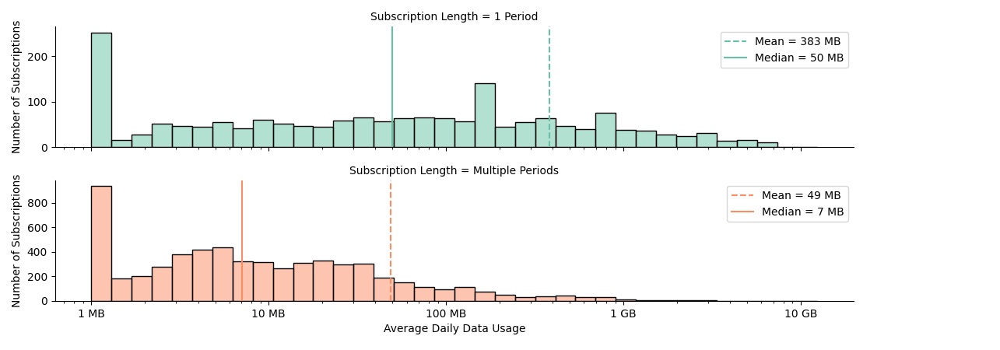
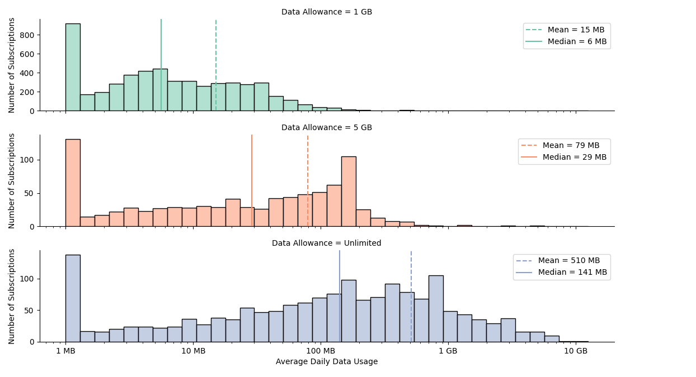
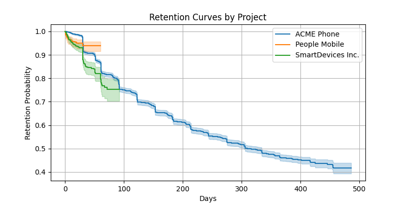

# Senior Data Analyst Hiring Challenge - Findings Slack Message

Hi team 👋,

I dived into the questions you had regarding the data consumption and retention. I worked with one dataset to answer all questions. For now: 
- I removed subscriptions with duplicate or missing data, and subscriptions without any data, voice or sms usage. 
- I assumed that you wanted to see the average daily data usage per subscription.
- I assumed that subscriptions that have a period end in the 31 days prior to the last date in the dataset have not churned.

## Data consumption

You can see the distribution of the daily data usage accross all subscriptions below. I distinghuised between subscription that end after just one period and subscriptions that span multiple periods, because subscriptions length has a large effect on the data usage.

*This chart shows how much data a subscription uses on average per day. The bars show how many subscriptions fall into each usage range, while the lines mark the average (mean) and the midpoint (medium) of all subscriptions.*

If we look at the data usage at different plan data allowances we see what we would expect: higher allowance leads to higher usage. And again, we see lot of subscriptions that do not use any data.

Please note that because subscriptions vary in length and usage is typically higher at the beginning of the subscription, the average usage on any given day will be lower than the overall average from this calculation (short subscriptions are overrepresented in the average). It may therefore be more meaningful to look at the average data usage at the subscription **and** period level instead.   

### Further investigation

- Decide whether we should look at data usage on subscription level (this calculation) or subscription **and** period level.
- Why do users who churn after one period use more data?
- Why are there a lot of users (even for the unlimited plan) who hardly use any data?

## Retention

I compared user retention across the three projects and found that the difference in retention patterns is statistical significant. Some projects really do retain users better or worse than others, not just by chance. This means there might be meaningful  behavioral differences between the projects that we can act on.

*Each line shows the probability that a user from each project remains active over time. When a line drops, users are churning. The project whose line stays higher retains users better.*

### Further investigation
    
- What is the correct definition of churn?
- What makes the retention curves different?
